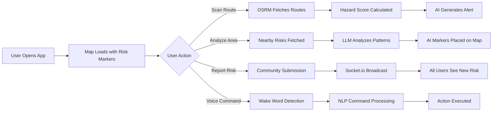

<p align="center">
  
</p>

---

## Deploying

This repo is now set up for container-based deployment and Railway.

### Railway

1. Push this repository to GitHub.
2. In Railway, create a new project from the GitHub repo.
3. Add a MySQL service in the same Railway project.
4. Set the app service environment variables:

```env
DATABASE_URL=${{MySQL.MYSQL_URL}}
PORT=3000
LLM_PROVIDER=nvidia
NVIDIA_API_KEY=your_key_here
DB_SYNC_ALTER=false
MYSQL_SSL=false
```

5. Deploy the app service. Railway will use `railway.json` and the `/health` endpoint.

### Docker

```bash
docker build -t micro-alert .
docker run --env-file .env -p 3000:3000 micro-alert
```

### Notes

- `DATABASE_URL` is preferred for cloud deployment.
- Set `MYSQL_SSL=true` if your hosted MySQL provider requires SSL.
- File uploads are stored on local disk, so they are ephemeral on most cloud platforms unless you attach persistent storage.

<h1 align="center">🚨 Micro-Alert</h1>
<h3 align="center">AI-Powered Road Risk Intelligence & Smart Navigation Platform</h3>

<p align="center">
  <em>Identifying, aggregating, and communicating small repeated road risks — sudden braking zones, blind turns, habitual violations — to everyday commuters <strong>without causing information overload.</strong></em>
</p>

<p align="center">
  
  
  
  
  
  
  
</p>

---

## 🎯 Problem Statement

Every day, commuters face **micro-moments of road risk** — a spot where everyone suddenly brakes, a blind turn no one sees coming, or a junction where violations are habitual. These aren't dramatic accidents; they're **small, repeated, invisible dangers** that traditional navigation apps completely ignore.

> **Micro-Alert** solves this by identifying these micro-risks, aggregating real-time data, and delivering **concise, AI-powered alerts** that keep drivers informed without overwhelming them.

---

## 🌟 Key Features

### 🗺️ Interactive Dark-Themed Risk Map
- Full-screen geospatial map powered by **Leaflet + CARTO dark tiles**
- Color-coded risk markers with severity ratings (1–5 scale)
- Click-to-inspect popups with full risk details, weather, time-of-day context
- Real-time user location tracking with accuracy visualization

### 🧠 AI-Powered Intelligence (Multi-Provider LLM)
| Feature | Description |
|---------|-------------|
| **Route Risk Scanner** | Enter any two locations worldwide → get a condensed ≤20-word AI alert |
| **Area Analysis** | Pan the map → ask AI about risk patterns in the visible area |
| **Risk Explainer** | Click "Explain This Risk" on any marker for contextual, AI-generated insight |
| **Location Extraction** | AI responses include geocoded location markers plotted directly on the map |

> Supports **NVIDIA NIM (GPT-OSS-120B)**, **OpenAI GPT-4o-mini**, and **Groq Mixtral-8x7B** — switch providers via a single `.env` variable.

### 🛣️ Multi-Route Hazard-Aware Routing
- Fetches up to **3 alternative routes** via OSRM (OpenStreetMap Routing Machine)
- Each route scored with a **real-time hazard score** based on nearby risks & hazards
- Routes ranked as 🛡️ **Safest**, ⚡ **Balanced**, and 📏 **Shortest**
- Visual route comparison with distance, ETA, and hazard level

### 🔮 Accident Risk Predictor
Real-time risk scoring engine considering **5 weighted factors**:
- 📊 Historical accident density (0–40 pts)
- 🚗 Speed vs. limit analysis (0–25 pts)
- 🌧️ Weather conditions (0–15 pts)
- 🕐 Time of day (0–10 pts)
- 🛣️ Road type (0–10 pts)

Outputs a 0–100 risk score with color-coded gauge and actionable recommendations.

### 🌡️ Risk Density Heatmap
- Toggle gradient-based heatmap visualization
- Instantly identify high-risk corridors and accident-prone zones
- Dynamic color gradient: 🔵 Low → 🟡 Medium → 🔴 Critical

### 🎙️ Voice Assistant
- **Wake-word activated** — say "wake up" to start
- Natural language commands for routing, emergency dispatch, and risk analysis
- Text-to-speech responses with Indian English localization
- Commands: *"Best route to T. Nagar"*, *"Call ambulance"*, *"Check risk here"*

### 🚨 Emergency Services & Dispatch
- **One-click dispatch**: Ambulance 🚑 · Police 👮 · Fire 🚒 · Roadside 🆘
- Real-time GPS coordinates sent with every dispatch
- Nearest hospitals, police stations, and fire stations displayed on map
- Distance-sorted emergency services list with phone numbers

### 📝 Community Risk Reporting
- Citizens can report new micro-risks with type, severity, description, and map-picked location
- User reports appear as pulsing markers (pending admin verification)
- Real-time broadcast to all connected users via Socket.io

### ⭐ Driver Safety Rating
- Continuous speed monitoring via browser Geolocation API
- 5-star rating system based on speed-to-limit ratio
- Live rating badge in the navigation bar
- Speed logging and leaderboard support

### 🛡️ Admin Control Center
- Dashboard with risk statistics, clearance rates, and severity breakdowns
- Verify, clear, reactivate, or permanently delete risks
- Bulk operations (clear by type, clear selected)
- Emergency dispatch management with status tracking
- Driver speed leaderboard

---

## 🏗️ System Architecture

```
┌─────────────────────────────────────────────────────────────────┐
│                         CLIENT (Browser)                        │
│  ┌──────────┐  ┌──────────┐  ┌──────────┐  ┌───────────────┐  │
│  │ Leaflet  │  │  Voice   │  │   Chat   │  │    Admin      │  │
│  │  Map.js  │  │ voice.js │  │  chat.js │  │   admin.js    │  │
│  └────┬─────┘  └────┬─────┘  └────┬─────┘  └──────┬────────┘  │
│       │              │             │               │            │
│       └──────────────┴─────────────┴───────────────┘            │
│                          │ REST + WebSocket                     │
└──────────────────────────┼──────────────────────────────────────┘
                           │
┌──────────────────────────┼──────────────────────────────────────┐
│                    SERVER (Node.js + Express)                   │
│  ┌──────────┐  ┌──────────┐  ┌──────────┐  ┌───────────────┐  │
│  │ API      │  │ Routing  │  │Prediction│  │  Emergency    │  │
│  │ Routes   │  │ Engine   │  │  Engine  │  │  Dispatch     │  │
│  └────┬─────┘  └────┬─────┘  └────┬─────┘  └──────┬────────┘  │
│       │              │             │               │            │
│  ┌────┴──────────────┴─────────────┴───────────────┴────────┐  │
│  │                    Socket.io (Real-time)                  │  │
│  └──────────────────────────┬───────────────────────────────┘  │
│                             │                                   │
│  ┌──────────────────────────┴───────────────────────────────┐  │
│  │              Sequelize ORM + MySQL Database               │  │
│  │  Risk │ Hazard │ Accident │ SpeedLog │ User │ Dispatch    │  │
│  └───────────────────────────────────────────────────────────┘  │
│                             │                                   │
│  ┌──────────────────────────┴───────────────────────────────┐  │
│  │              External APIs                                │  │
│  │  NVIDIA NIM │ OpenAI │ Groq │ OSRM │ Nominatim Geocoder  │  │
│  └───────────────────────────────────────────────────────────┘  │
└─────────────────────────────────────────────────────────────────┘
```

---

## 📁 Project Structure

```
Micro-Alert/
├── server.js                 # Express + Socket.io entry point
├── seed.js                   # Database seeder (50+ Chennai risk events)
├── create_db.sql             # MySQL database creation script
├── package.json
├── .env.example              # Environment template
│
├── models/
│   ├── index.js              # Sequelize connection & model registry
│   ├── Risk.js               # Road risk events (GeoJSON-like)
│   ├── Hazard.js             # Admin-managed hazard zones
│   ├── Accident.js           # Historical accident records
│   ├── SpeedLog.js           # Driver speed tracking entries
│   ├── EmergencyDispatch.js  # Emergency dispatch records
│   └── User.js               # User accounts
│
├── routes/
│   ├── api.js                # Core REST API + LLM integration
│   ├── routing.js            # Multi-route hazard-aware pathfinding
│   ├── prediction.js         # Accident risk prediction engine
│   ├── emergency.js          # Emergency services & dispatch
│   ├── speed.js              # Speed logging & safety ratings
│   └── admin.js              # Admin dashboard API
│
├── views/
│   ├── index.ejs             # Main application view
│   └── admin.ejs             # Admin control center
│
├── public/
│   ├── css/
│   │   └── style.css         # Complete dark-mode design system
│   └── js/
│       ├── map.js            # Leaflet map, markers, heatmap, routing
│       ├── chat.js           # LLM chat & area analysis interactions
│       ├── voice.js          # Voice assistant (Web Speech API)
│       └── admin.js          # Admin dashboard frontend
│
└── scripts/
    └── nvidia-chat.js        # NVIDIA NIM API test script
```

---

## 🚀 Quick Start

### Prerequisites

| Requirement | Version |
|-------------|---------|
| **Node.js** | 18+ |
| **MySQL** | 8.0+ |
| **API Key** | NVIDIA NIM, OpenAI, or Groq |

### 1️⃣ Clone & Install

```bash
git clone https://github.com/your-username/Micro-Alert.git
cd Micro-Alert
npm install
```

### 2️⃣ Setup MySQL Database

```sql
CREATE DATABASE IF NOT EXISTS microalert;
```

### 3️⃣ Configure Environment

```bash
cp .env.example .env
```

Edit `.env` with your credentials:

```env
# Database
MYSQL_DB=microalert
MYSQL_USER=root
MYSQL_PASSWORD=your_password
MYSQL_HOST=localhost

# AI Provider (choose one: nvidia, openai, or groq)
LLM_PROVIDER=nvidia
NVIDIA_API_KEY=nvapi-your-key-here

# Server
PORT=3000
```

<details>
<summary>🔀 <strong>Using a different AI provider?</strong></summary>

**OpenAI:**
```env
LLM_PROVIDER=openai
OPENAI_API_KEY=sk-your-key-here
```

**Groq:**
```env
LLM_PROVIDER=groq
GROQ_API_KEY=gsk_your-key-here
```
</details>

### 4️⃣ Seed the Database

```bash
npm run seed
```

> Populates 50+ realistic micro-risk events across Chennai — Kathipara Junction, Gemini Circle, Spencer Plaza, ECR, OMR, and more.

### 5️⃣ Start the Server

```bash
npm start
```

Open **[http://localhost:3000](http://localhost:3000)** in your browser. 🎉

---

## 🔌 API Reference

### Risk Management

| Method | Endpoint | Description |
|--------|----------|-------------|
| `GET` | `/api/risks` | All risks, sorted by severity |
| `GET` | `/api/risks/nearby?lat=X&lng=Y&radius=500` | Risks within radius (meters) |
| `GET` | `/api/risks/along-route?startLat&startLng&endLat&endLng` | Risks along a route corridor |
| `POST` | `/api/risks/report` | Report a new community micro-risk |
| `GET` | `/api/hazards` | All active admin hazard zones |

### AI / LLM

| Method | Endpoint | Description |
|--------|----------|-------------|
| `POST` | `/api/llm/summarize` | AI area analysis with location extraction |
| `POST` | `/api/llm/condensed-alert` | Condensed route alert (≤20 words) |

### Routing & Prediction

| Method | Endpoint | Description |
|--------|----------|-------------|
| `POST` | `/api/routing/find-routes` | Multi-route pathfinding with hazard scores |
| `POST` | `/api/prediction/risk-score` | Real-time accident risk scoring |
| `GET` | `/api/prediction/route-risk` | Full route risk analysis |

### Emergency & Speed

| Method | Endpoint | Description |
|--------|----------|-------------|
| `GET` | `/api/emergency` | Nearest emergency services |
| `POST` | `/api/emergency/dispatch` | Create emergency dispatch |
| `POST` | `/api/speed/log` | Log a speed reading |
| `GET` | `/api/speed/rating` | Current session driving rating |
| `GET` | `/api/speed/leaderboard` | Top-rated drivers |

---

## 🎯 Demo Routes to Try

| Route | What You'll Discover |
|-------|---------------------|
| **Anna Nagar → T. Nagar** | Blind turns at Anna Nagar, violations near Pondy Bazaar |
| **Tambaram → Adyar** | Kathipara Junction braking zone, Guindy violations |
| **Chennai Central → Marina Beach** | Flower Bazaar violations, Mount Road blind turn corridor |
| **Porur → Sholinganallur** | OMR highway risks, suburban intersection hazards |

---

## 🏗️ Tech Stack

| Layer | Technology |
|-------|-----------|
| **Runtime** | Node.js 18+ |
| **Framework** | Express 4.x |
| **Database** | MySQL 8.0 + Sequelize ORM |
| **Real-time** | Socket.io 4.x |
| **Maps** | Leaflet 1.9 + CARTO Dark Tiles + Leaflet.heat |
| **Routing** | OSRM (OpenStreetMap Routing Machine) |
| **Geocoding** | Nominatim (OpenStreetMap) |
| **AI/LLM** | NVIDIA NIM (GPT-OSS-120B) / OpenAI / Groq |
| **Voice** | Web Speech API (Recognition + Synthesis) |
| **Templating** | EJS |
| **Styling** | Custom CSS — dark mode, glassmorphism, design tokens |
| **Typography** | Inter + JetBrains Mono (Google Fonts) |

---

## 🧠 How It Works



---

## 🌐 Real-Time Features

Micro-Alert uses **Socket.io** for live communication:

- 🔔 **New risk broadcasts** — All users see newly reported risks instantly
- 📍 **Location sharing** — Connected users share live positions
- 🚨 **Emergency dispatch alerts** — Dispatch notifications propagate to all clients
- ⚠️ **Hazard updates** — Admin changes reflect in real-time

---

## 🛡️ Admin Panel

Access the admin dashboard at **[/admin](http://localhost:3000/admin)**:

- 📊 Risk statistics dashboard (total, active, cleared, by type, by severity)
- ✅ Verify and clear resolved risks
- 🔄 Bulk operations (clear by type, clear selected)
- 🚨 Emergency dispatch management
- ⭐ Driver speed safety leaderboard

---

## 📜 License

MIT License — Built for hackathons, open for contributions.

---

<p align="center">
  <strong>⚡ Micro-Alert</strong> — Making invisible road dangers visible, one micro-moment at a time.
</p>
